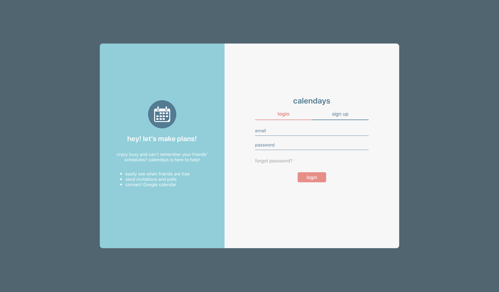
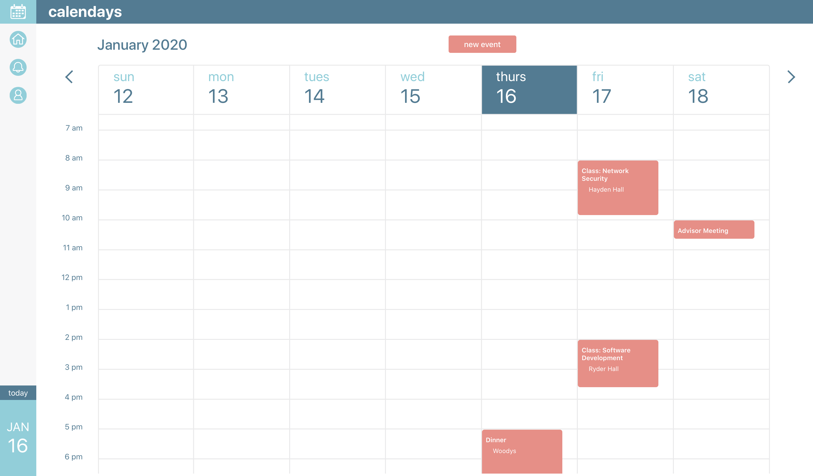
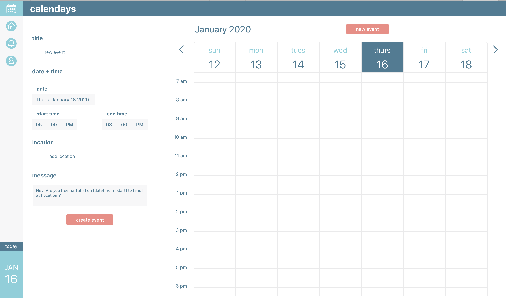
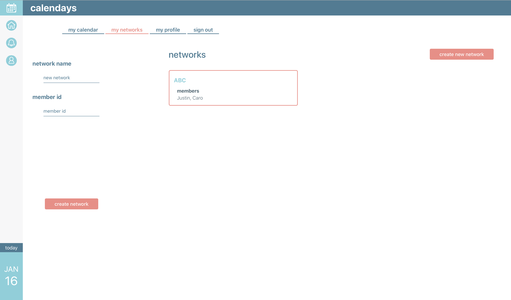

# Calendays
### React Web App
Web application used for shared event planning. Uses Firebase for user authentication and storing user data (events, networks, profile). Once authenticated and verified, users can create events to be displayed on their calendar. Users can also create named networks, which consist of groups of two or more users.

## Project Breakdown
### screenshots/
* This folder contains a series of screenshots taken throughout the development of the application
### src/
* `index.css`: css for the index page
* `index.tsx`: TypeScript for the index page; initializes and configures Firebase for the application; renders the main `App` component in a `BrowserRouter`
* `MainRoutes.tsx`: configures the routes for the application
  * `https://calendays.jkonecny.com/`->`Login` (login screen)
  * `https://calendays.jkonecny.com/home`->`Home` (shared calendar)
  * `https://calendays.jkonecny.com/user`->`Home` (user calendar, user profile)
  * `https://calendays.jkonecny.com/notifications`->`Home` (event notifications)
  * `https://calendays.jkonecny.com/reset`->`Reset` (password reset)
### src/components/calendar/...
* `Calendar.tsx`: component that given user events, renders the main calendar for the current week of the month; additional weeks are rendered as the user changes the displayed week
* `CalendarDay.js`: component used by `Calendar`; represents one 'day' in week (one calendar column); renders given list of events at their specified times
* `NewEvent.tsx`: component to allow the user to create a new event; handles updating the Firebase store with newly created event
### src/components/common/...
* `DropdownDate.tsx`: dropdown component used for selecting from a list of date
* `DropdownTime.tsx`
* `DropdownNetwork.tsx`
* `InputField.tsx`
### src/components/main/...
* `App.tsx`
* `Constants.ts`
* `Home.tsx`
* `Login.tsx`
* `NavBar.tsx`
* `Notifications.tsx`
* `Reset.tsx`
* `User.tsx`
### src/components/networks/...
* `Group.tsx`
* `Networks.tsx`
* `NewNetwork.tsx`
### src/components/profile/...
* `Profile.tsx`
### src/data/...
* `NetworkEvent.ts`
* `NetworkGroup.ts`
* `NetworkUser.ts`
* `Pages.ts`
* `UserProfile.ts`

## User Interface
### Login Screen

### Landing Screen

### Event Creation Screen

### Network Creation Screen

